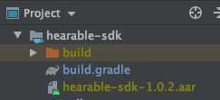
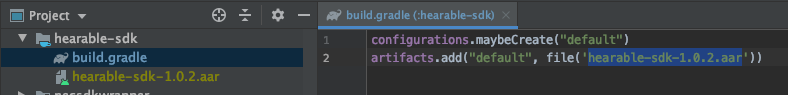
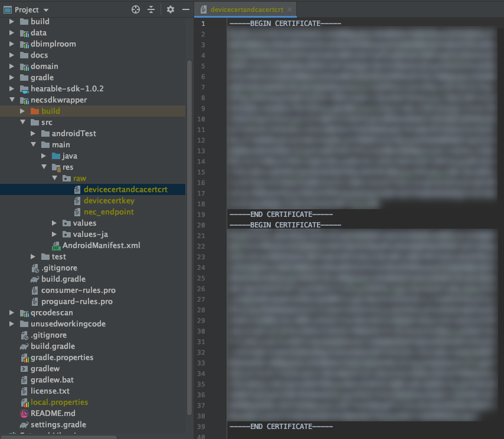
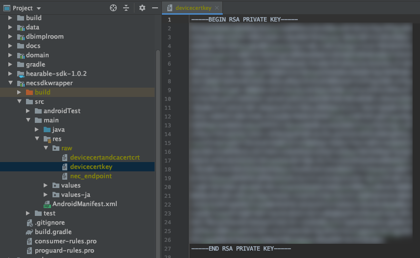
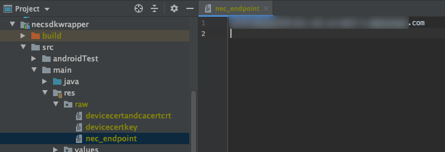

# ZEPPELINpublic/earpiece_recognition
Android app for connecting to NEC Heararable hardware

## Quick start

### _Prerequisites_
 - NEC hearable "NH1" hardware device (provided by NEC)

#### Copy NEC SDK .aar file (provided under separate cover) to project
 - copy file `hearable-sdk-X.X.X.aar` to `hearable-sdk/hearable-sdk-X.X.X.aar`; below is example for .aar file `hearable-sdk-1.0.2.aar`: 

 - in file `hearable-sdk/build.gradle` modify the .aar version number; below is example for .aar file `hearable-sdk-1.0.2.aar`: 

 
#### Copy sensitive files (provided under separate cover) to project
 - copy file `devicecertandcacertcrt` to `necsdkwrapper/src/main/res/raw/devicecertandcacertcrt` 

 - copy file `devicecertkey` to `necsdkwrapper/src/main/res/raw/devicecertkey` 

 - copy file `nec_endpoint` to `necsdkwrapper/src/main/res/raw/nec_endpoint` 
   - (alternatively create new file and paste in provided url, without leading `http://` or `https://`) 

Without all of the above, it won't be possible to use the app.

### _NEC hearable setup_ 
 - Long press power button for 5 seconds to enter pairing mode
 
### _Android handset setup_ 
 - in system bluetooth settings, pair with hearable
 - _**IMPORTANT**_ remove NEC SDK sample app if installed (only 1 app using NEC SDK may be installed at a time)

## Caveats
 - Proguard config will be necessary for apps based on this project requiring code obfuscation
 
## Architecture flow overview
Based on AAC "Navigation" component, it is easy to see how the navigation flow proceeds by opening file 
`app/src/main/res/navigation/mobile_navigation.xml` 

_Nav graph: enter hearable ID and connect via BLE_

")

_Nav graph: register and verify user via electronic sounds and display user home screen_

")

## Known issues

### Bluetooth is hard
Bluetooth is hard, especially when both "Classic" and BLE connections are required.  There are many ways to trigger
unintended behavior in the app, for example 
 - turning off Wi-fi when connecting to the hearable
 - revoking location permission while deep in the connection flow
 - unpairing with hearable, or pairing with a different hearable, while the app is active

Any of these actions are highly likely to result in undefined behavior, so
best advice is simply "Don't do that then."  

It is also not possible for the app to detect every bluetooth "Classic"/BLE connection state
anomaly, and it is suggested that at the first sign of connection trouble the app be restarted.

Also, due to complex nature of Bluetooth "Classic" and BLE flow state, traditional "back/up" navigation is
unfortunately not well supported.  Once BLE is connected, cleanly disconnecting can be problematic so again
restarting the app is generally advised instead of relying on bubbling up the backstack.

### QR Code scanning
The 3rd party QR code scanner adopted sometimes fails to start the camera feed; workaround is to click
the small "keyboard" button, then from the keyboard entry screen click the small "camera" icon to toggle
back to QR code scan screen

### Lottie animations
Lottie animations are heavy (bitmap rather than vector based); worst case may need to disable them
as they may trigger OOM on older or lower-end android handsets.

_Copyright (c) 2020 ZEPPELIN, Inc.(https://zeppelin.co.jp)_
